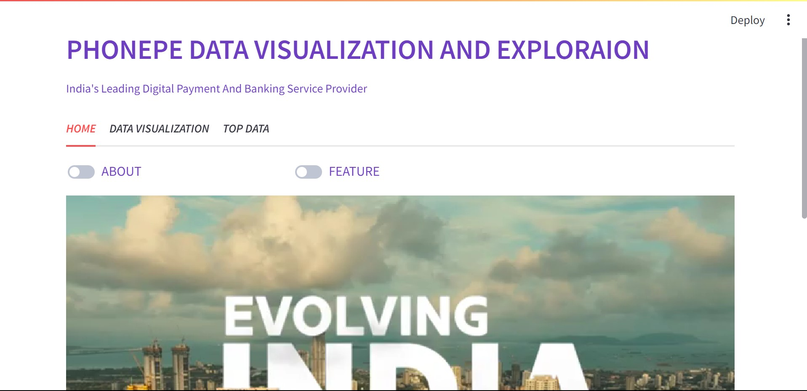

## PHONEPE-PulSE-VISUALIZATION Data 2018-2023:
* Phonepe-pulse is the dashboard built using Streamlit. Digital Payment has seen a huge surge in recent years 2k.Crs to 12K.Crs from 2018 to 2023. Post-Pandemic There was a revolution in the digital payment industry in India. Phonepe was launched in 2016 by Sameer Nigam, Rahul Chari, and Burzin Engineer. Phonepe Has around 45% market share in the Digital payment industry. This Dashboard will show all relevant information regarding Phonepe by using Geo-visualization and other visualizations for more interaction. The Dataset is available for free on the [PhonePe Pulse website](https://www.phonepe.com/pulse/explore/transaction/2022/4/) and [GitHub](https://github.com/PhonePe/pulse).


## WANT TO WATCH VIDEO OF THE PROJECT : - [click here](https://www.linkedin.com/feed/update/urn:li:activity:7136725510591582208/)

## COMPARISON WITH OTHER DIGITAL PAYMENT:


## MODULES REQUIRED :
* [Streamlit](https://docs.streamlit.io/) - To Create simple and interactive UI
* [Plotly](https://dash.plotly.com/) -  To Create pictorial of data
* [Pandas](https://pandas.pydata.org/docs/) - To Create a Data Frame for scatter data
* [Json](https://docs.python.org/3/library/json.html) - To Import Dataset
* [postgresql](https://www.postgresql.org/docs/) - To Transfer Data and store

## WORKFLOW : 
# STEP 1: 
* IMPORTING MODULES :
    ```
    import streamlit as st
    import os
    import pandas as pd
    import json
    import psycopg2
    import requests
    import plotly.express as px
    import numpy as np
    from PIL import Image ```
# STEP 2 : 
* IMPORTING DATA FROM Phonepe pulse -
* DATA EXTRACTION AND TRANSFORMATION 
  ```
  data
  |___ aggregated
      |___ transactions
          |___ country
              |___ india
                  |___ 2018
                  |    1.json
                  |    2.json
                  |    3.json
                  |    4.json
                  
                  |___ 2019
                  |    ...
                  |___ 2019
                  |___ state 
                      |___ andaman-&-nicobar-islands
                          |___2018
                          |   1.json
                          |   2.json
                          |   3.json
                          |   4.json
  
                      |___ andhra-pradesh
                      |    ...
                      |    ...
*  As the Data are in various folders which were shown above we use for loop to retrieve the data. Initially, we get the path and store the path in one variable to get it. After getting the data we use for loop to get the desired data
  ```
      #Aggregated Trandsaction
      path1="Path of json file"
      agre_path=os.listdir(path1)
      columns1={"States":[],"year":[],"quater":[],"transaction_type":[],"transaction_count":[],"transaction_amount":[]}
      for s in agre_path:
          states=path1+s+"/"
          agre_years=os.listdir(states)
      
          for y in agre_years:
              years=states+y+"/"
              agre_file=os.listdir(years)
              
              for f in agre_file:
                  files=years+f
                  data=open(files,"r")
      
                  d=json.load(data)
      
                  for i in d["data"]['transactionData']:
                      name=i['name']
                      count=i['paymentInstruments'][0]['count']
                      amount=i['paymentInstruments'][0]['amount']
                      columns1['transaction_type'].append(name)
                      columns1['transaction_count'].append(count)
                      columns1['transaction_amount'].append(amount)
                      columns1['States'].append(s)
                      columns1['year'].append(y)
                      columns1['quater'].append(int(f.strip(".json")))
    
      agre_trans=pd.DataFrame(columns1)
```
* Once the was retrieved store it in the dictionary and convert it into data frame by using pandas
# STEP 3 :
* The third step is to store the retrieved data in the database. I used Postgresql for this project
```
  #SQL Table creation 
  #Aggregated_transaction Table
  
  mydb=psycopg2.connect(host='localhost',user='postgres',password='****',database='phonepe',port=****)
  cursor=mydb.cursor()
  
  drop='''drop table if exists aggregated_transaction'''
  cursor.execute(drop)
  mydb.commit()
  
  createtable='''create table if not exists aggregated_transaction(States varchar(100),
                                                                  year int,
                                                                  quater int,
                                                                  transaction_type varchar(500),
                                                                  transaction_count bigint,
                                                                  transaction_amount bigint)'''
  cursor.execute(createtable)
  mydb.commit()
  
  for inder,row in agre_trans.iterrows():
      insert='''insert into aggregated_transaction(States,
                                                   year,
                                                   quater,
                                                   transaction_type,
                                                   transaction_count,
                                                   transaction_amount)
                                                   
                                                   values(%s,%s,%s,%s,%s,%s)'''
      values=(row['States'],
              row['year'],
              row['quater'],
              row['transaction_type'],
              row['transaction_count'],
              row['transaction_amount'])
      
      cursor.execute(insert,values)
      mydb.commit()
```
* Initially create the table based on the required data and transfer the values to the table which was created.
# STEP - 4
# Data visualization : 
* In this project I used Geo-map, bar, and Pia chart for visualization by using Plotly
* GEO-Map - Choropleth. In this project, I changed the name of the states based on the geojson file.
  ```
  url  ="https://gist.githubusercontent.com/jbrobst/56c13bbbf9d97d187fea01ca62ea5112/raw/e388c4cae20aa53cb5090210a42ebb9b765c0a36/india_states.geojson"
    response =requests.get(url)
    Gdata1=json.loads(response.content)

    agre_tran.States=agre_tran.States.str.title()
    agre_tran['States']=agre_tran['States'].replace(['Andaman-&-Nicobar-Islands'],'Andaman & Nicobar')
    agre_tran['States']=agre_tran['States'].replace(['Dadra-&-Nagar-Haveli-&-Daman-&-Diu'],'Dadra and Nagar Haveli and Daman and Diu')
    agre_tran['States']=agre_tran['States'].str.replace('-',' ')

    map2=agre_tran[['States','transaction_count','quater','year']]
    
    fig = px.choropleth(
                    map2,
                    geojson=Gdata1,
                    locations= "States",
                    featureidkey= "properties.ST_NM",
                    color= "transaction_count", 
                    color_continuous_scale="solar", 
                    range_color= (0,3000000),
                    title="TRANSACTION COUNT", 
                    hover_name= "States", 
                    animation_frame= "year", 
                    animation_group= "quater")

    fig.update_geos(fitbounds="locations", visible=False)
    fig.update_layout(height=600,width=800)
    fig.show()
  ```
  * Geo-Map shows the transaction amount and counts from 2018-2023. Which is easier to understand
  * PIA CHART - The PIA chart is used in various aspects of the project like top 10 districts, top transactions etc.
  ```
      lowt= agre_tran[["States","transaction_count"]]
      lowt1= lowt.groupby("States")["transaction_count"].sum().sort_values(ascending=False)
      lowt2= pd.DataFrame(lowt1).reset_index()
  
      fig_lt= px.bar(lowt2, x= "States", y= "transaction_count", title= "HIGHEST COUNT and STATES",
                  color_discrete_sequence=px.colors.sequential.Cividis_r)
      fig_lt.update_layout(width= 1000, height= 500)
      return st.plotly_chart(fig_lt)
  ```
  # STEP 5 - DASHBOARD UI
  * STREAMLIT - Streamlit is a simple and clean open-source module used in the project to create a web page.
    

# Key Point :
 * Phonepe was launched in 2016 in Bangalore. Now It was geared up by taking 1.5M transactions and 3.2M transaction amounts across India.
 *  The Application has most transactions in P2P payment and Merchant payments.
 *  Bangalore holds 25.6% of transactions and the mobile brands in which the transaction takes place were Xiaomi and Samsung.
## 
**In This project we can explore more inference**

<p align="center">
<b><em>TOP LANGUAGE:</em></b> <br/>


<p align="center">
<b><em>Point of Contacting:</em></b> <br/>
  
<a href="mailto:narennrsj@gmail.com"></a> <a href="<https://www.linkedin.com/in/narayana-ram-sekar-b689a9201/>"></a>
